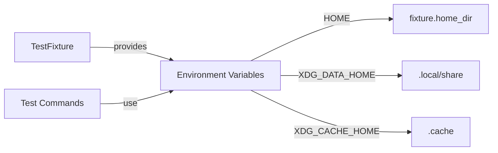

# Test Suite for poof

This directory contains comprehensive tests for the poof CLI application.

## Test Organization

Tests are organized into the following structure:

```
tests/
├── common/                   # Shared test utilities and fixtures
├── fixtures/                 # Test data and environment setup
├── integration/              # Integration test modules
│   ├── command_handling/     # Tests for general argument parsing/handling
│   └── commands/             # Tests for specific CLI commands
├── integration.rs            # Entry point for integration tests
└── README.md
```

## Test Categories

All tests are currently implemented as integration tests under the `integration` test target.

### Command Tests (`tests/integration/commands/`)

These tests cover specific CLI commands:

- **check**: Checks if bin directory is in PATH
- **download**: Downloads binaries (requires network for real tests)
- **enable**: Adds bin directory to PATH
- **help**: Command-line help
- **info**: Shows platform and environment information
- **install**: Downloads and installs binaries (requires network for real tests)
- **list**: Lists installed binaries
- **update**: Updates installed binaries
- **use**: Sets default version
- **version**: Shows version information

### Command Handling Tests (`tests/integration/command_handling/`)

These tests cover general argument parsing and handling:

- **claps**: Tests related to clap argument parsing
- **verbose_flags**: Tests for verbose flag handling

## Test Utilities

### TestFixture

The `TestFixture` struct in `tests/common/fixtures/test_env.rs` provides:

- Temporary directory setup
- Fake installation creation
- Automatic cleanup

All tests use temporary file systems and never touch the actual file system.

Test environment's handling of temporary directories and environment variables is shown below



### Shared Helper Functions

The `tests/common/helpers.rs` module provides shared utility functions used across integration tests:

#### `set_test_env(cmd: &mut Command, fixture: &TestFixture)`

Configures a `Command` with isolated environment variables from a `TestFixture`. This ensures tests run in a temporary environment without touching the actual file system.

**Sets the following environment variables:**
- `HOME` - Points to the fixture's temporary home directory
- `XDG_DATA_HOME` - Points to `.local/share` (Linux only)
- `XDG_CACHE_HOME` - Points to `.cache` (Linux only)

**Usage example:**

```rust
use super::common::fixtures::test_env::TestFixture;
use super::common::helpers::set_test_env;

let fixture = TestFixture::new()?;
let mut cmd = Command::new(cargo::cargo_bin!("poof"));
cmd.arg("list");
set_test_env(&mut cmd, &fixture);
let output = cmd.output()?;
```

This helper is used across all command integration tests to ensure proper environment isolation.

#### Other Helper Functions

- `run_command(args: &[&str])` - Executes a command and returns `(success, stdout, stderr)`
- `assert_contains_all(text: &str, substrings: &[&str])` - Asserts that text contains all specified substrings

### Repository Format Validation

The `tests/common/repo_format_validation.rs` module provides reusable functions for testing repository format validation across different commands:

- `test_invalid_repo_formats_for_command(command: &str)` - Tests that various invalid formats are rejected
- `test_valid_repo_formats_for_command(command: &str)` - Tests that valid formats are accepted

These functions can be used in integration tests for any command that accepts repository arguments.

## Running Tests

```bash
# Run all tests
cargo test

# Run all integration tests
cargo test --test integration

# Run specific test modules
cargo test --test integration check
cargo test --test integration install
cargo test --test integration list

# Run with output
cargo test -- --nocapture

# Run specific test function
cargo test test_version_command_exists
```

## Test Best Practices

1. **No File System Changes**: All tests use `tempfile::TempDir` for temporary directories via `TestFixture`.
2. **Serial Execution**: Stateful tests use `#[serial_test::serial]` to prevent race conditions.
3. **Environment Isolation**: Tests use `.env()` on `Command` instances instead of global environment variables.
4. **Error Handling**: Tests use `Result<(), Box<dyn std::error::Error>>` for proper error propagation.
5. **Descriptive Names**: Test names follow `test_<function>_<scenario>_<expected_result>` pattern.

## Notes

- Integration tests that require network access (like `install`) may be skipped in CI or use mocks.
- The `enable` command tests modify shell RC files in temporary directories only.
- All tests are designed to be idempotent and safe to run multiple times.
